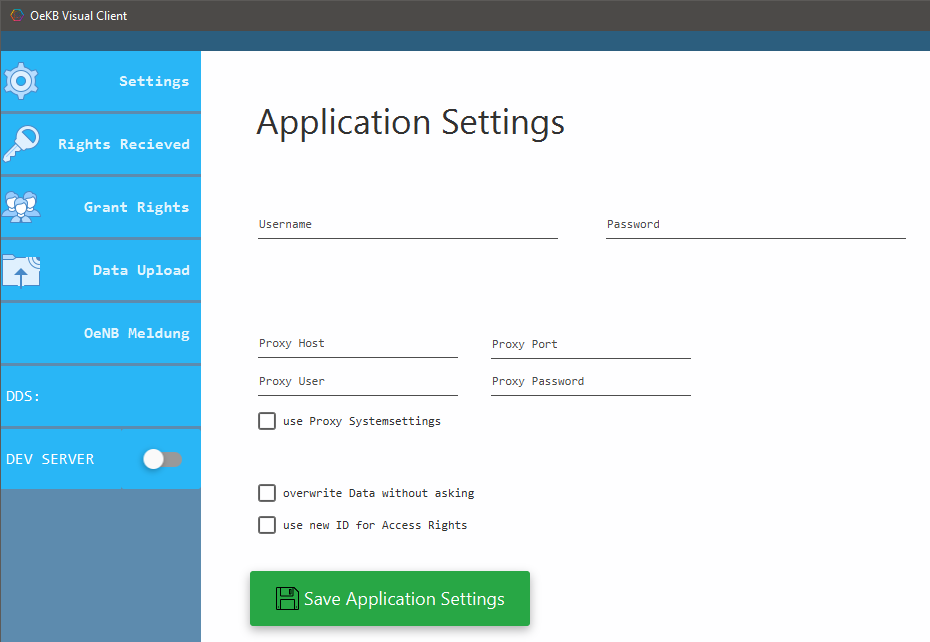

# OeKBVisualClient

TODO: info

# Download
[Download the latest release here](https://github.com/karlkauc/OeKBVisualClient/releases)

Nur Systemuser - kein WebUser

# More information
Visit the [project page](http://karlkauc.github.io/OeKBVisualClient) for more information.

# Screenshots

# License
Apache License, Version 2.0

By using this software you agree to

Oracle Binary Code License Agreement for the Java SE Platform Products and JavaFX
Oracle Technology Network Early Adopter Development License Agreement in case of EA releases
Use it at your own risk.